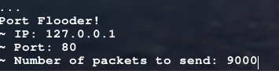
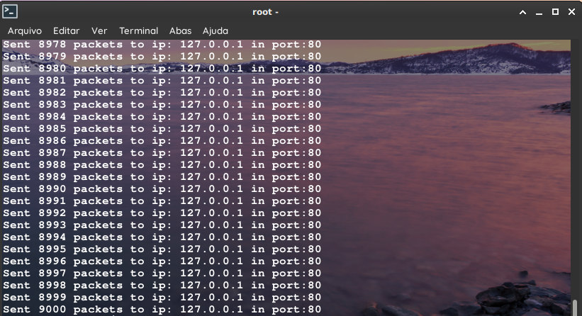
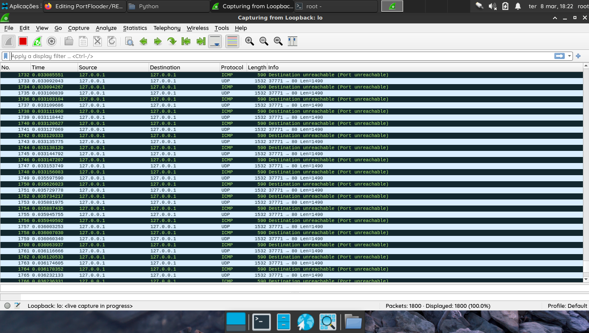

# PortFlooder

- This is a script that flood packets to a port on the ip you want, and the number of packets you want!

for example you type this on the script:

The program will flood **just** the port 80, and "Number of packets" times.

Output:

I did the test and checked the impact on wireshark

As you can see, the wireshark detected it as unreachable port,this is because i dont have a service running at port 80...but.. all packets are here, the script works!

# Versions

[Version 1.0](https://github.com/Shokolalad/PortFlooder/blob/main/PortFlooderV1-0.py) - simple

[Version 1.1](https://github.com/hashcipher/portflooder/blob/main/PortFlooderV1-1.py) - with timer
